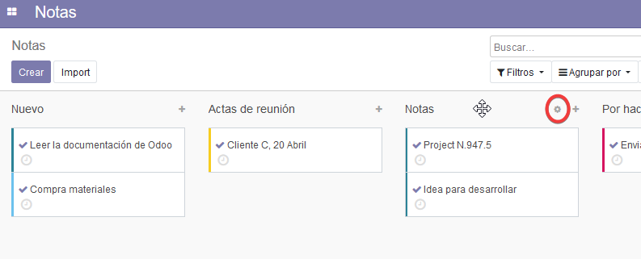

#####
Notas
#####

- Organice su trabajo con recordatorios con Notas en Odoo.

.. image:: pics/hAntZSbLSf.png

Como hacer su lista de tareas pendientes
==========================================

Etapas
------------

Desglosar sus listas de tareas pendientes en etapas que se convertirán en columnas en su escritorio.

Para crear una nueva columna o etapa simplemente hay que hacer click en el botón **Agregar una Columna**.

.. image:: pics/1AXkhcYtua.png

Para acceder a la configuración de cualquier columna deslize el puntero del ratón hacia el título de la columna, aparecerá un nuevo icono y haga click en él para que aparezcan las siguientes opciones:

- **Doblar**: Dobla la columna temporalmente.
- **Editar tapa**: Abre una nueva ventana donde se permite:
    - Modificar el nombre de la columna.
    - Doblar la columna por defecto.
- **Suprimir**: Elimina la columna.

Vista Kanban
------------

Arrastrar y soltar notas fácilmente desde una etapa a otra en vista kanban.

Crear notas
-----------

Añadir notas a sus etapas. Cada nota corresponde a un miniproyecto que cambiará de una etapa a otras a medida que su proyecto avanza.

Organize sus notas
=======================

Formato de texto
-----------------

Insertar estilos de texto como encabezados, negrita, itálica, listas y fuentes con un simple editor WYSIWYG.

Archivos adjuntos
-----------------
Adjuntar a sus notas documentos de texto, documentos de imagen.

Etiquetas
----------
Añadir etiqueta a sus notas para una clara organización.

Filtros y grupos
-----------------
Buscar notas fácilmente gracias a filtros inteligentes.

Colores
-------
Agrupar sus notas por color como medio para categorizar sus tareas. Hay 9 colores para elegir y una opción sin color.

Importación
--------------
Subir cualquier documento de texto o documento a sus notas.

Exportar
---------
Exportar notas como HTMl, texto plano o documentos Docu/Wiki.

Colaborar
=======================

Invitar a gente
---------------

Añadir cotrabajadores a sus notas para que puedan seguir las discusiones y recibir notificaciones.

Autoría del color
------------------

Cada autor que escribe algún texto en una nota tiene diferente color de fondo para mostrar quién ha escrito qué. Puede vincular un nombre con un color.

Slider de línea de tiempo
--------------------------

Ver el historial de cambios hecho a una nota de forma cronológica, de la primera a la última frase.

Compartir
----------
Compartir fácilmente sus notas con sus colegas enviándoles un enlace o una URL integrada.

Acceso a la configuración
--------------------------
Elegir lo que otros pueden hacer con sus notas permitiendo la vista o el acceso a la edición.

Chat
-------
Permitir chat para discusiones en tiempo real con los que siguen sus notas.

Mostrar los usuarios conectados
--------------------------------
Ver quien está conectado ahora a sus notas.
