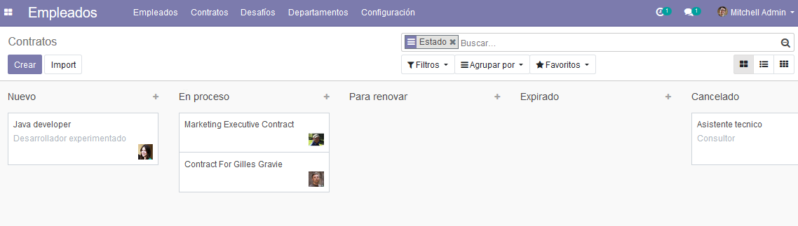
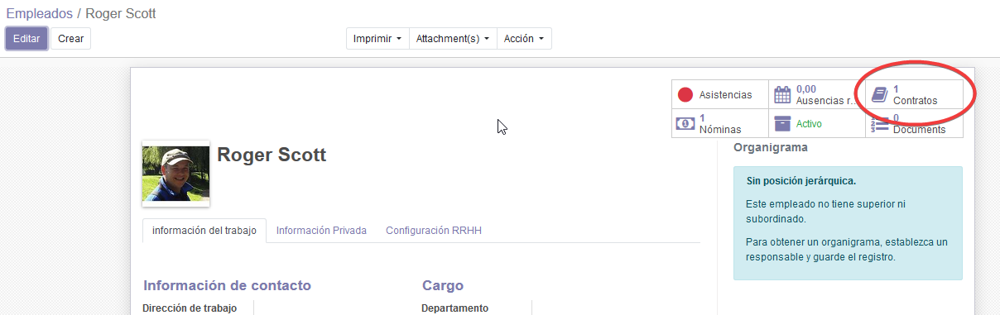
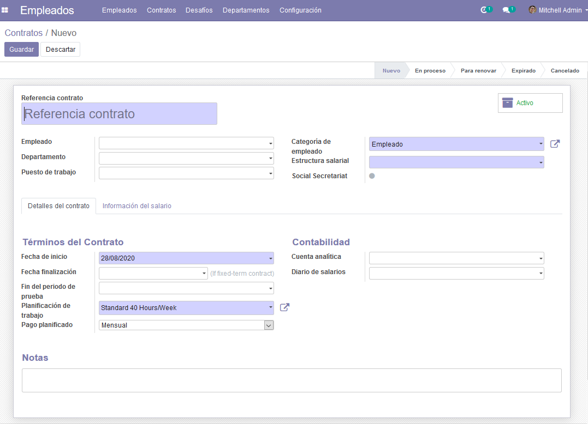
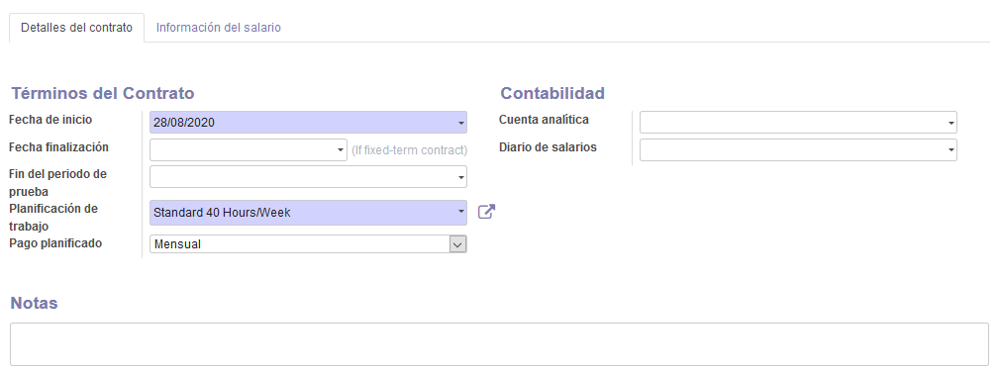
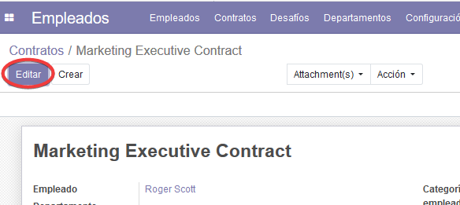
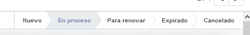
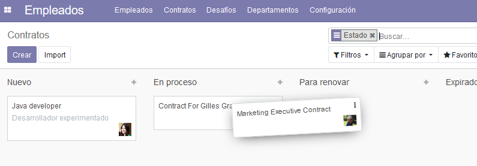
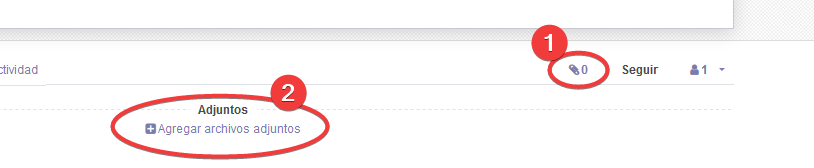

**********
Contratos
**********

Este módulo nos permitirá al departamento de recursos humanos administrar los contratos de nuestros empleados.

Acceso
======

Para ir acceder a los contratos vayamos al módulo Empleados y hagamos click en el menú **Contratos**.

Desde el tablero podemos ver rápidamente los contratos existentes y su estado en las diferentes columnas: *Nuevo*, *En Proceso*, *Para renovar*, *Expirado*, *Cancelado*.

    Vista general

También podemos acceder a los contratos de cualquier empleado desde su propia ficha de empleado, haciendo click en el
botón **Contratos**, de esta forma veremos únicamente los contratos de dicho empleado:

Creando un contrato
===================

Para crear un contrato nuevo hagamos click en el botón **Crear**

    Un contrato en blanco

En el formulario podemos seleccionar el *Empleado*, *Departamento* y otra información básica desde las pestañas desplegables
y asignar el contrato directamente al empleado deseado.

Pestaña *Detalles del Contrato*:
    Aquí podremos indicar fechas de inicio y fin del contrato, fecha de finalización del periodo de prueba, además del tipo de contrato y más detalles relacionados con la contabilidad.

    Detalles del Contrato

Pestaña *Información del Salario*:
    Aquí deberemos añadir información respecto al salario del empleado.

.. figure:: pics/03.png
    :align: center

    Información del Salario

Actualizando/Eliminando un contrato manualmente
================================================
Los administradores pueden actualizar información, el estado del contrato o incluso eliminar un contrato.
Para ello vayamos al contrato deseado, y hagamos click en **Editar** y cambiemos los valores necesarios.

    Editando que es gerundio

Para editar el estado del contrato podemos hacerlo directamente haciendo click en la franja superior

    Estados disponibles

También podremos editar el estado de los contratos arrastando los contratos de columna en la vista inicial.

    Actualizando manualmente el estado.

Actualizaciones automáticas
==============================
Para que los estados se actualizen automaticamente de acuerdo con su fecha de finalización los contratos deberán estar al menos **En Proceso**.

Cualquier contrato en estado **Nuevo** se considera como borrador.

Definición de los diferentes estados o columnas:

- **Nuevo**: El contrato esta en borrador.
- **En progreso**: El contrato esta activo.
- **Para Renovar**: El contrato esta activo y expira proximamente.
- **Expirado**: La fecha de finalización del contrato es anterior a la fecha actual.
- **Cancelado**: El contrato ha sido cancelado.

FAQ - Preguntas Frecuentes
============================

¿Se pueden adjuntar archivos asociados a los contratos?
    Por supuesto y de cualquier tipo, para ello simplemente presionamos el botón ¨clip¨ (abajo a la derecha) dentro del contrato y a
    continuación aparecerá se botón *Agregar archivos adjuntos* y los archivos adjuntos si los hubiera.

