**********
Ausencias
**********

La gestión de ausencias en Odoo se realiza en dos etapas,
en la primera la *ausencia* es solicitada por el empleado,
Odoo genera un informe detallado para que en la segunda etapa el mánager o la persona
asignada analize el informe y pueda decidir si aprueba o rechaza la solicitud de
ausencia.
Para ir al módulo ausencias haga click en el menú principal y haga click en **Ausencias**.

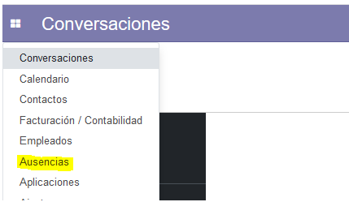

    Pidiendo vacaciones

Tipos de Ausencias
==================

Para comenzar vamos a definir que es un tipo de ausencia.
Por defecto Odoo ya incluye los tipos de ausencias más comunes, sin embargo,
usted puede modificarlos o incluso crear sus propios tipos de ausencias.
Para configurar los tipos de ausencias dentro de **Ausencias** vayamos a:

    **Configuración -> Tipos de ausencias.**

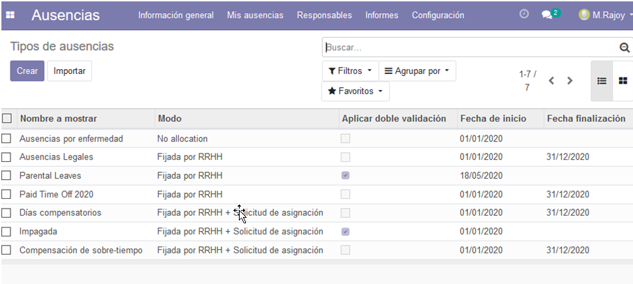

    Por defecto Odoo ya incluye algunos tipos de ausencias

Una vez aquí podemos especificar los tipos de ausencias que los empleados pueden
solicitar, como pueden ser vacaciones, baja por enfermedad, compensación de horas
extras, entre otras. Para crear un nuevo tipo de ausencia haga click en Crear.

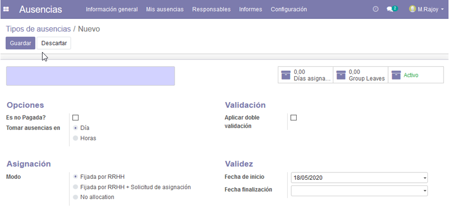

    Campos sombreados en azul son obligatorios, el nombre en este caso

Aplicar doble validación:
    Si queremos que el tipo de ausencia necesite doble aprobación una por parte del manager y otra por parte de recursos humanos.

Modos de Asignación:
    - **Fijada por RRHH**: RRHH es la responsable de asignar la cantidad de dias u horas que los empleados tendrán disponibles, por ejemplo vacaciones anuales.
    - **Fijada por RRHH + Solicitud de Asignación**: En un principio RRHH es responsable de asignar la cantidad de dias u horas, además el empleado podrá solicitar dias u horas extras.
    - **No allocation (Sin Asignación)**: La cantidad de dias u horas no esta fijada, por ejemplo baja por enfermedad.

Configuración de los tipos de Ausencias
========================================

Las cantidad de días por Ausencia disponible es facilmente configurable en Odoo, para ello el departamento de recursos humanos deberá asignar la cantidad de dias u horas que cada empleado pueda solicitar.

**Nota**:
    Unicamente podremos asignar dias dentro de la fecha de validez del tipo de ausencia.

Para la configuración de los tipos de ausencias en Odoo vayamos a **Configuración > Tipos de Ausencias**, abrimos el tipo de Ausencia que queramos configurar y click en dias asignados:

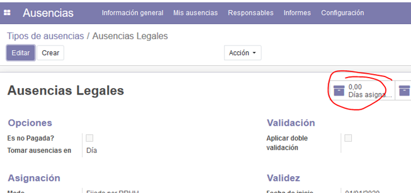

Click en **Crear**

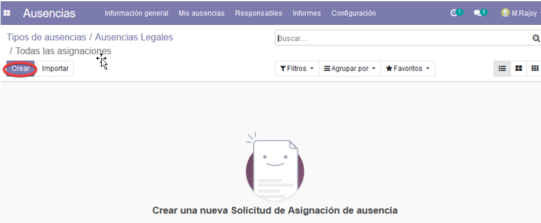

Y a continuación en la siguiente pantalla podrá configurar los dias asignados para ese tipo de ausencia.

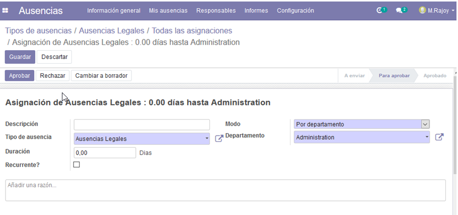

En **Modo**, podrá selecionar que empleados se verán afectados, podrá filtrar por departamento, empleado, empresa o etiqueta y departamento.

Solicitando Ausencias
=======================

El empleado que quiera solicitar una ausencia via Odoo deberá ir **Mis Ausencias > Nueva solicitud > Crear**

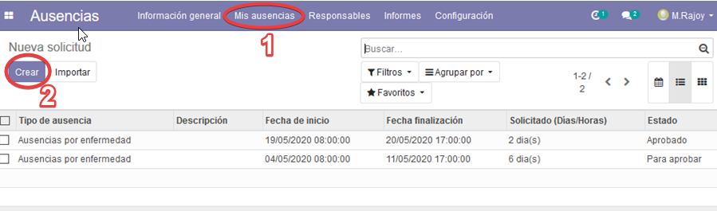

En el siguiente menú podemos completar más detalles sobre la ausencia.

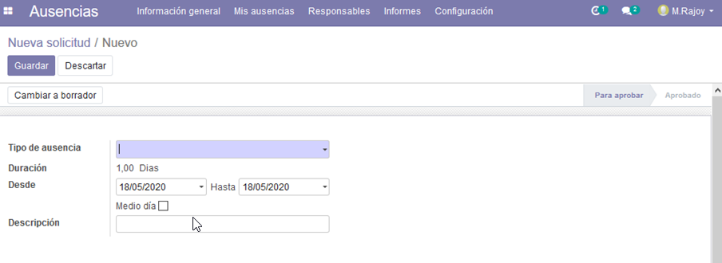

- Tipo de ausencia: podemos elegir el tipo de ausencia en el menú desplegable.
- Duración: de la ausencia mediante fechas, especificar si fuera solo medio dia.
- Descripción: Opcional.

Complete la información y haga click en **Guardar**.

A continuación el estado de la ausencia pasará a ser *Para aprobar*, una vez que el encargado apruebe la solicitud cambiará a *Aprobado*.

Aprobando Ausencias
=====================

**Nota**:
    Solo los usuarios con permisos para aprobar Ausencias tendrán acceso a las siguientes funciones.

Una vez que el empleado ha creado la solicitud de ausencia el encargado de recursos humanos o manager recibirá una notificación en Odoo.

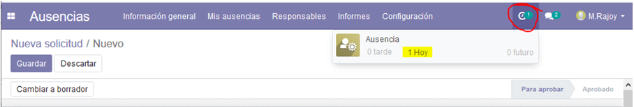

Existen dos formas para acceder a las solicitudes pendientes:
- Haga click en la notificación
- En el menú de Ausencias > Responsable > Ausencias

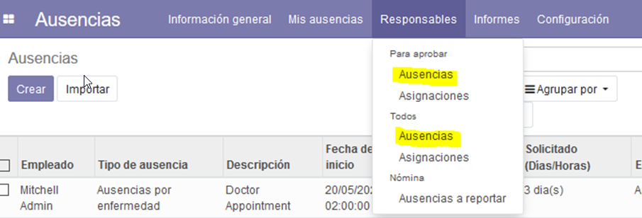

Aquí se mostrarán todas las Ausencias, y el responsable podrá Aprobar o Rechazar las peticiones.

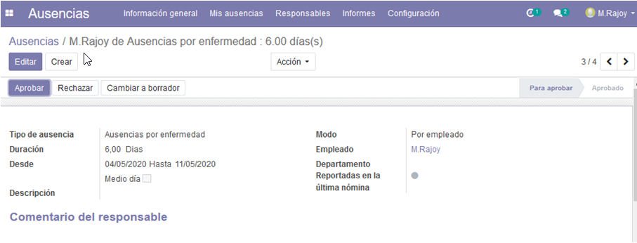

    Seis dias de baja por enfermedad

Informes de Ausencias
=======================

El administrador puede crear un detallado y personalizado informe en su tablero o dashboard. Para ello vaya a **Informes > Analisis de Ausencias**.

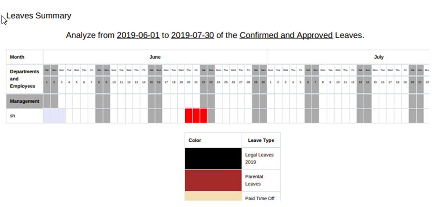

Solicitud de Asignaciones
===========================

A diferencia de las ausencias, las **asignaciones** son la cantidad de días u horas que el empleado tendrá disponibles para su disfrute.
El empleado puede solicitar una asignación (generalmente en caso de largas ausencias).
Para que el empleado pueda solicitar una asignación deberá ir a **Ausencias > Mis Ausencias > Solicitud de Asignaciones > Crear**

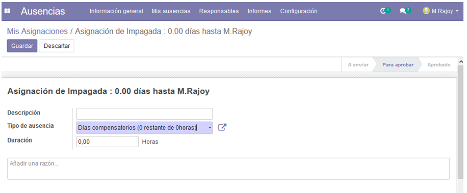

Aquí el empleado deberá completar:
- Descripción: No es obligatoria pero si muy recomendable.
- Tipo de ausencia: Obligatorio.
- Duración en dias u horas.
- Razón: Siempre ayuda.

Una vez que se hayan completado los datos y hecho click en **Guardar**, la solicitud será enviada al encargado para su aprobación.

Permisos
==========
TODO

FAQ - Preguntas Frecuentes
============================

¿Hay que excluir los fines de semanas al solicitar una ausencia?
    No es necesario, Odoo tiene en cuenta la jornada laboral asignada a cada empleado para contabilizar los días.
    Es decir, si la jornada laboral del empleado es de lunes a viernes, Odoo no contabilizará los sabados y domingos.

¿Y los festivos?
    Odoo también tiene en cuenta los días festivos a la hora de solicitar una ausencia o vacaciones.
    **Ojo!!** El adminitrador deberá configurar los días festivos previamente en Odoo.